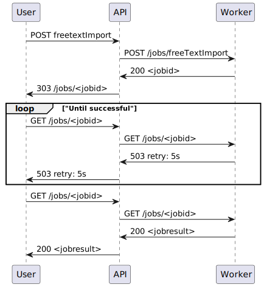

```puml
@startuml

package "Modern MISP" {
  [API]
  [Worker]
  [Frontend]
}
Frontend -- API
API - Worker

needs: []

database "MySql"
database "Redis"

[API] --> MySql
[Worker] --> MySql
[Worker] - Redis

@enduml
```




# Util
## ::: mmisp.util
## ::: mmisp.util.partial
## ::: mmisp.util.crypto
## ::: mmisp.util.models
## ::: mmisp.util.uuid
# API
## ::: mmisp.api
## ::: mmisp.api.config
## ::: mmisp.api.main
## ::: mmisp.api.auth
# Routers
## ::: mmisp.api.routers
## Taxonomies
### ::: mmisp.api.routers.taxonomies
## User Settings
### ::: mmisp.api.routers.user_settings
## Authentication
### ::: mmisp.api.routers.authentication
## Events 
### ::: mmisp.api.routers.events
## Tags
### ::: mmisp.api.routers.tags
## Objects
### ::: mmisp.api.routers.objects
## Attributes
### ::: mmisp.api.routers.attributes
## Jobs
### ::: mmisp.api.routers.jobs
## Users
### ::: mmisp.api.routers.users
## Feeds
### ::: mmisp.api.routers.feeds
## Warninglists
### ::: mmisp.api.routers.warninglists
## Noticelists
### ::: mmisp.api.routers.noticelists
## Sightings
### ::: mmisp.api.routers.sightings
## Authentication Keys
### ::: mmisp.api.routers.auth_keys
## Sharing Groups
### ::: mmisp.api.routers.sharing_groups
## Servers
### ::: mmisp.api.routers.servers
## Galaxies
### ::: mmisp.api.routers.galaxies
## Galaxies Cluster 
### ::: mmisp.api.routers.galaxies_cluster
## Organizations
### ::: mmisp.api.routers.organizations
## Statistics
### ::: mmisp.api.routers.statistics
