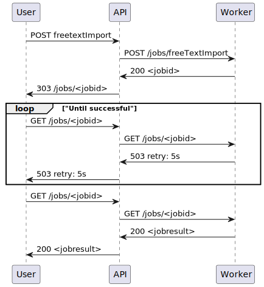

<!---
### ::: mmisp.api.config
    options:
      show_source: false
--->
## ::: mmisp.util
## ::: mmisp.util.partial
## ::: mmisp.util.crypto
## ::: mmisp.util.models
## ::: mmisp.util.uuid
## ::: mmisp.api
## ::: mmisp.api.config
## ::: mmisp.api.main
## ::: mmisp.api.auth
## ::: mmisp.api.routers
## ::: mmisp.api.routers.taxonomies
## ::: mmisp.api.routers.user_settings
## ::: mmisp.api.routers.authentication
## ::: mmisp.api.routers.events
## ::: mmisp.api.routers.tags
## ::: mmisp.api.routers.objects
## ::: mmisp.api.routers.attributes
## ::: mmisp.api.routers.jobs
## ::: mmisp.api.routers.users
## ::: mmisp.api.routers.feeds
## ::: mmisp.api.routers.warninglists
## ::: mmisp.api.routers.noticelists
## ::: mmisp.api.routers.sightings
## ::: mmisp.api.routers.auth_keys
## ::: mmisp.api.routers.sharing_groups
## ::: mmisp.api.routers.servers
## ::: mmisp.api.routers.galaxies
## ::: mmisp.api.routers.galaxies_cluster
## ::: mmisp.api.routers.organizations
## ::: mmisp.api.routers.statistics
