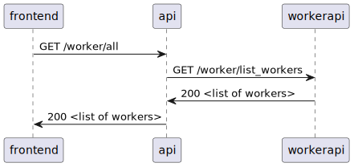

### ::: mmisp.api.routers.worker

#### API-Worker-Integration

The following diagram shows an example interaction between the api and the private worker api. In this case the list of mmsip workers is requested by the frontend.

